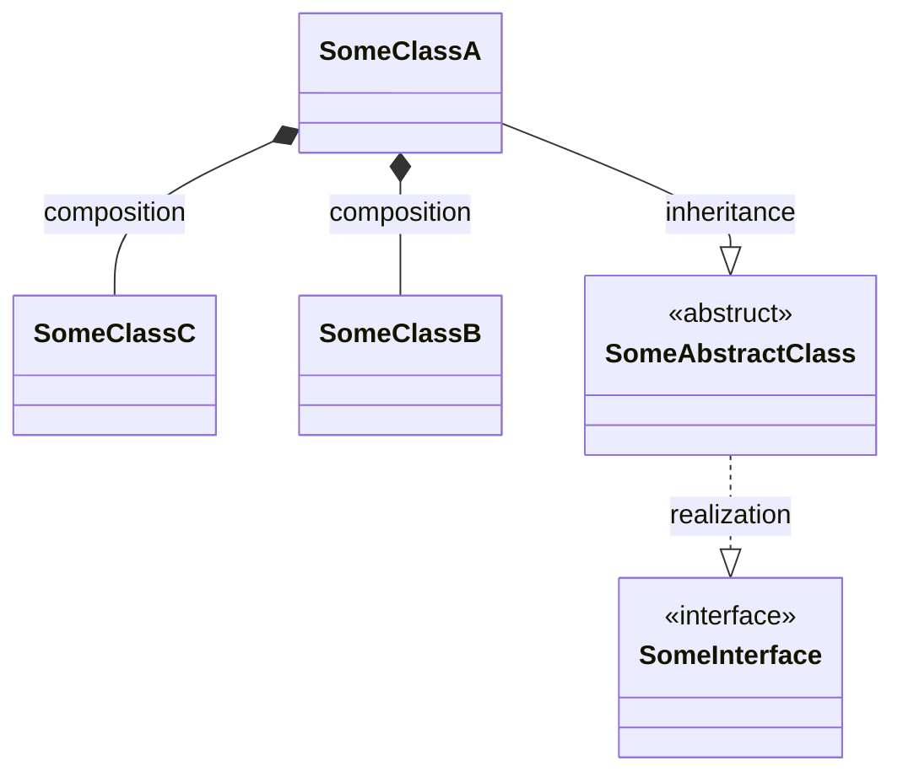
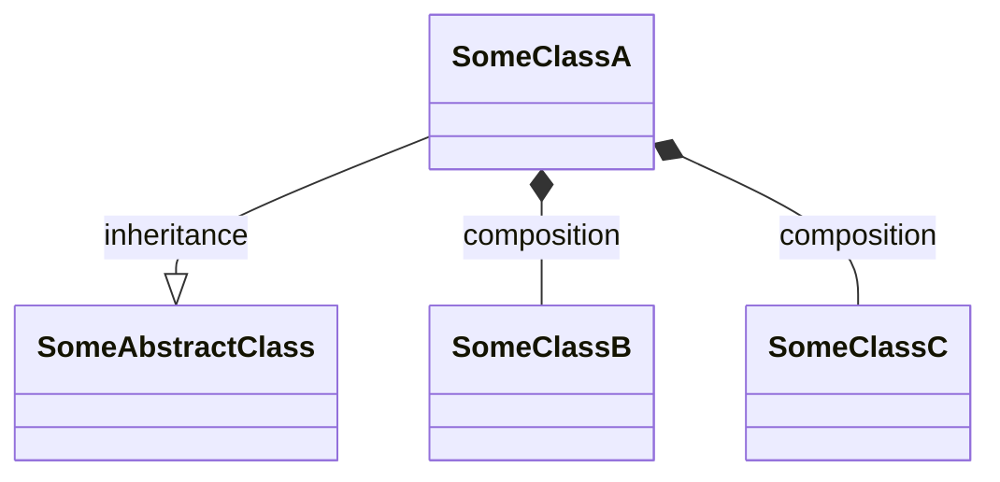

# Mermaid class diagram generater

## Overview
Generate Mermaid-js class diagram from php code.  
This tool focuses on the relationships between classes and omits the details of class internals at this stage.
## Installation
Via Composer
```shell
composer require --dev tasuku43/mermaid-class-diagram
```

## Usage
Here is an example run on a sample project
```shell
$ tree
.
├── composer.json
├── composer.lock
├── src
│   ├── SomeAbstractClass.php
│   ├── SomeClassA.php
│   ├── SomeClassB.php
│   ├── SomeClassC.php
│   └── SomeInterface.php
└── vendor
```
```php
class SomeClassA extends SomeAbstractClass
{
    private SomeClassB $someClassB;

    public function __construct(private SomeClassC $someClassC)
    {
    }
}

class SomeClassB
{
}

class SomeClassC
{
}

abstract class SomeAbstractClass implements SomeInterface
{
}

interface SomeInterface
{
}
```
### Execute command by specifying a directory
```shell
$ vendor/bin/mermaid-class-diagram generate --path src
classDiagram
    class SomeClassC {
    }
    class SomeClassB {
    }
    class SomeAbstractClass {
        <<abstruct>>
    }
    class SomeClassA {
    }
    class SomeInterface {
        <<interface>>
    }

    SomeAbstractClass ..|> SomeInterface: realization
    SomeClassA --|> SomeAbstractClass: inheritance
    SomeClassA *-- SomeClassB: composition
    SomeClassA *-- SomeClassC: composition
```

### Execute command by specifying a file
```shell
$ vendor/bin/mermaid-class-diagram generate --path src/SomeClassA.php
classDiagram
    class SomeClassA {
    }

    SomeClassA --|> SomeAbstractClass: inheritance
    SomeClassA *-- SomeClassB: composition
    SomeClassA *-- SomeClassC: composition
```


## License
The MIT License (MIT). Please see [LICENSE](https://github.com/tasuku43/php-mermaid-class-diagram/blob/main/LICENSE) for more information.
