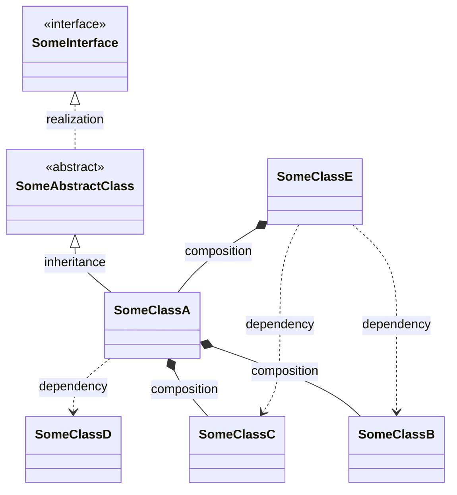
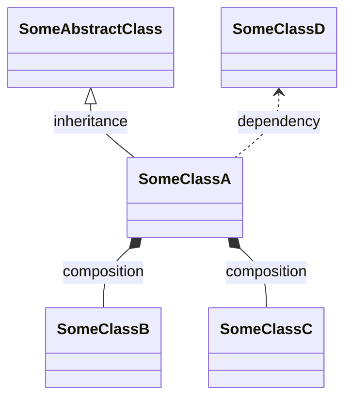
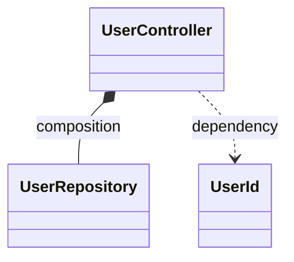
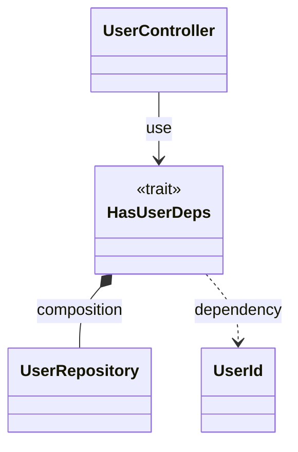

# Mermaid class diagram generater

## Overview
Generate Mermaid-js class diagram from php code.  
This tool focuses on the relationships between classes and omits the details of class internals at this stage.
## Installation
Via Composer
```shell
composer require --dev tasuku43/mermaid-class-diagram
```

## Usage

### Command
- `vendor/bin/mermaid-class-diagram generate --path <path> [options]`

### Options
- `--path <string>`: Required. Directory (recursively scanned) or single PHP file.
- `--exclude-relationships <csv>`: Hide edge types; case-insensitive; aliases supported.
  - `dependency|dependencies|dep|deps`
  - `composition|compositions|comp`
  - `inheritance|inheritances|extends`
  - `realization|realizations|implements`
- `--trait-mode <mode>`: Trait rendering mode. Default: `flatten`.
  - `with-traits` (aliases: `with_traits`, `with`): show trait nodes and `use` edges; suppress class-level comp/dep duplicates provided by traits.
  - `flatten` (aliases: `flat`): hide trait nodes and `use` edges; reassign trait-origin comp/dep to using classes; supports trait→trait→class chains; deduplicates.

### Examples
#### Execute command by specifying a directory (sample project)
```shell
$ vendor/bin/mermaid-class-diagram generate --path tests/data/Project
classDiagram
    class AbstractController {
        <<abstract>>
    }
    class AuditLogger {
    }
    class AuditTarget {
    }
    class User {
    }
    class UserController {
    }
    class UserRepository {
    }
    class UserRepositoryInterface {
        <<interface>>
    }
    class UserService {
    }
    class UserStatus {
        <<enum>>
    }

    User *-- UserStatus: composition
    AbstractController <|-- UserController: inheritance
    UserController *-- UserService: composition
    UserRepository ..> User: dependency
    UserRepositoryInterface <|.. UserRepository: realization
    UserRepositoryInterface ..> User: dependency
    UserService *-- AuditLogger: composition
    UserService ..> AuditTarget: dependency
    UserService ..> InvalidArgumentException: dependency
    UserService ..> User: dependency
    UserService *-- UserRepositoryInterface: composition
```

#### Execute command by specifying a file (sample file)
```shell
$ vendor/bin/mermaid-class-diagram generate --path tests/data/Project/Controller/UserController.php
classDiagram
    class UserController {
    }

    AbstractController <|-- UserController: inheritance
    UserController *-- UserService: composition
```


#### Filter relationships
You can hide specific relationship types via CSV with `--exclude-relationships`.

- Allowed values (case-insensitive, aliases supported):
  - `dependency` | `dependencies` | `dep` | `deps`
  - `composition` | `compositions` | `comp`
  - `inheritance` | `inheritances` | `extends`
  - `realization` | `realizations` | `implements`

Examples
```shell
# Hide dependencies and compositions
$ vendor/bin/mermaid-class-diagram generate --path src --exclude-relationships dependency,composition

# Hide only dependencies
$ vendor/bin/mermaid-class-diagram generate --path src --exclude-relationships dependency
```

#### Traits
There are two render modes for traits (the CLI uses Flatten by default):

- Flatten (default)
  - Hides trait nodes and `use` edges.
  - Reassigns trait-origin composition/dependency edges to the using classes.
  - Supports transitive trait chains (TraitA uses TraitB); edges are reassigned to the final class users.
- WithTraits
  - Shows trait nodes and `use` edges.
  - Keeps trait-origin composition/dependency edges on the trait.
  - Suppresses duplicate class-level composition/dependency when already provided by a used trait.

Example
```php
trait HasUserDeps {
    private UserRepository $repo;
    public function findById(UserId $id): ?User {}
}

class UserController {
    use HasUserDeps;
}
```
Output examples (order simplified):

Flatten (default)


WithTraits


## License
The MIT License (MIT). Please see [LICENSE](https://github.com/tasuku43/php-mermaid-class-diagram/blob/main/LICENSE) for more information.
